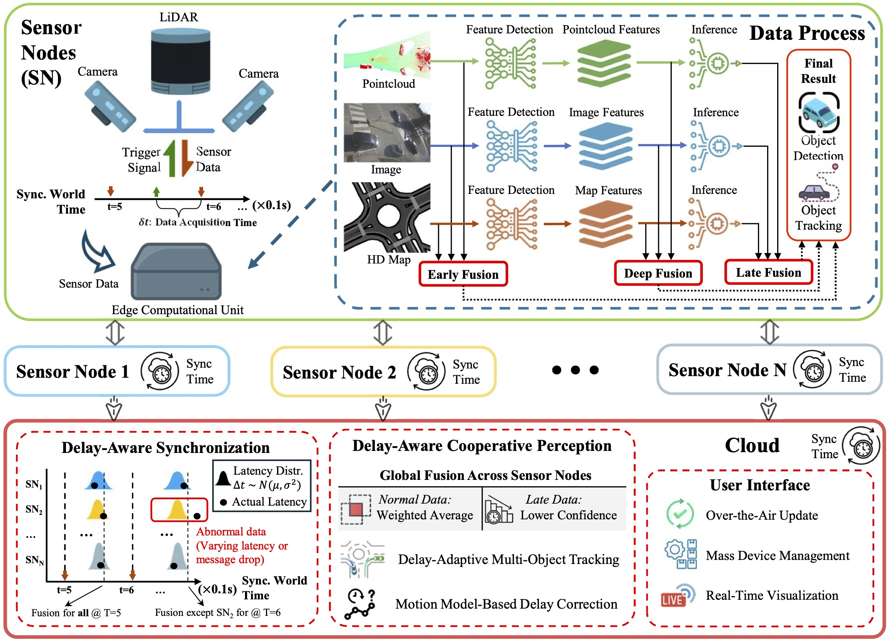
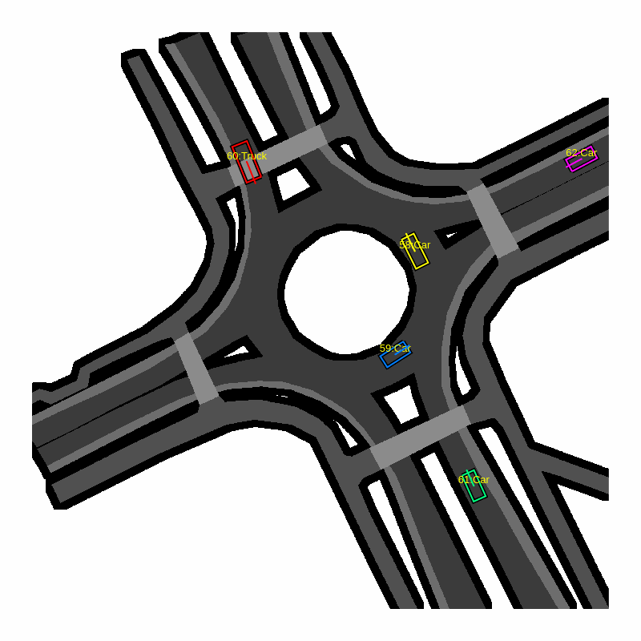
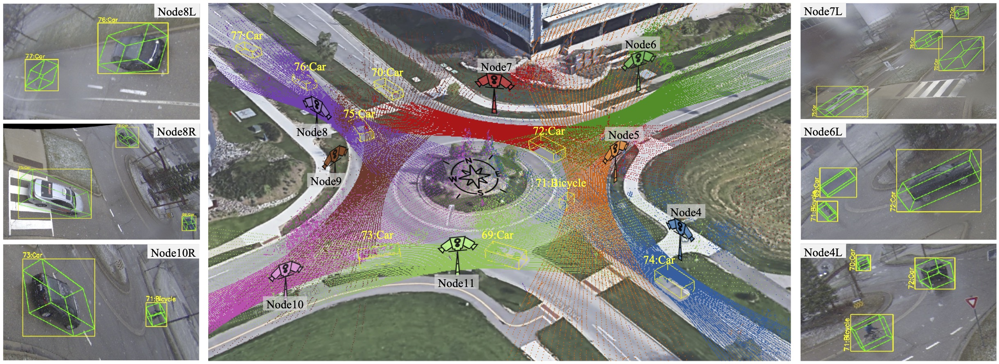
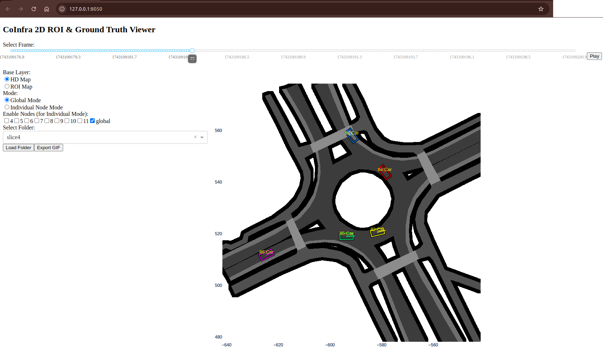
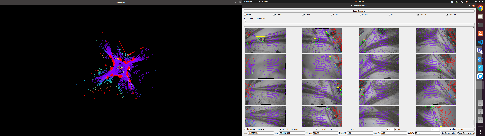
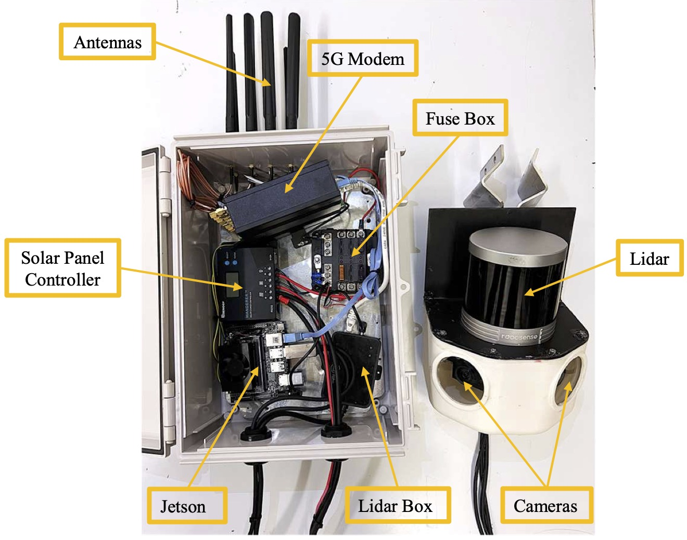
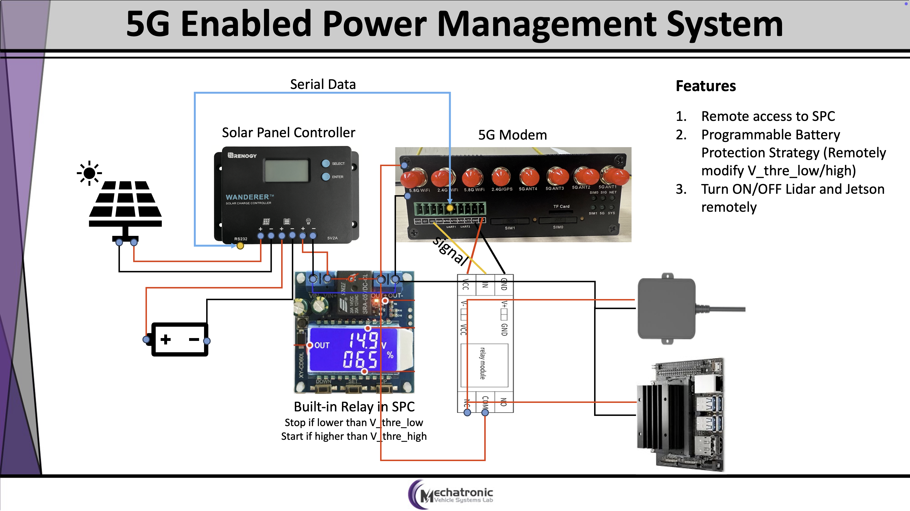

# CoInfra: A Large-Scale Cooperative Infrastructure Perception System and Dataset in Adverse Weather

📄 **[Arxiv Paper](https://arxiv.org/abs/2507.02245)**  

📦 **[Dataset Download](#-dataset-download)**

📂 **[Codebase Overview](#-codebase-structure)**

🏗️ **[Build Your Own Cooperative Perception System](#️-build-your-own-cooperative-perception-system)**

**CoInfra** is a real-world, large-scale cooperative perception system and dataset designed to support research in multi-agent perception, especially under **adverse weather conditions** (snow, rain, freezing rain). It features 14 synchronized infrastructure nodes, each with a LiDAR and dual cameras, deployed across a shared region for full-scene coverage.

<div style="text-align:center">

</div>

We release the **dataset** and **baseline experiments** to facilitate research in:
- Multi-node 3D object detection and tracking in adverse weather
- Delay-aware synchronization for real-time perception
- Motion prediction in interaction-rich roundabout scenario
    <div style="text-align:center">
    
    </div>

The **codebase** includes:
- [x] Dataset visualization tools for 2D and 3D
- [x] Web-based UI for mass device management, OTA updates, and a real-time visualization, etc if you are interested in [🏗️ Build Your Own Cooperative Perception System](#️-build-your-own-cooperative-perception-system)
- [ ] Baseline models for early and late fusion
- [ ] A ROS-based Sensor Node level and Cloud level late fusion system


---

<a name="dataset-download"></a>
## 📦 Dataset Download

<div style="text-align:center">

</div>

The CoInfra dataset includes around:
- **195k LiDAR frames**
- **390k camera images**
- **220k annotated 3D bounding boxes** across 5 classes (car, bus, truck, bicycle, pedestrian)
- **Adverse weather scenes**: ☀️ Sunny, 🌧️ Rainy, ❄️ Snowy, 🧊 Freezing Rain
- **HD map**
- **Calibration data** for camera-LiDAR and global alignment

### 🔗 Download Links
- A mini example dataset (1 slice, 1 scenario) is available for quick testing: [Mini Example Dataset](https://1drv.ms/u/c/12049174acdd4fe9/EeHlooyO6xdJnESRSzNbhQwBXJTbgYr2jJzK3Sn6ZVOFiw?e=REqKqV)
- Email to [MVS-Lab@uwaterloo.ca](mailto:MVS-Lab@uwaterloo.ca) for requesting the data
- Download the dataset from HuggingFace: [](https://huggingface.co/datasets/MinghaoNing/CoInfra)

Refer to [`docs/DATASET.md`](docs/DATASET.md) for data format, structure, and annotation schema.

---

<a name="codebase-structure"></a>
## 📂 Codebase Structure

### 1. Environment Setup
```bash
conda create -n coinfra python=3.10
conda activate coinfra
pip install -r requirements.txt
```

### 2. Visualization Tools
- **2D Visualization**: [`visualization/2D/main.py`](visualization/2D/main.py)
    - You need to set the `BASE_FOLDER_PATH` variable to the path of your dataset folder.
    - Then run `python visualization/2D/main.py` to visualize the dataset in a web-based UI.
    <div style="text-align:center">
    
    </div>

- **3D Visualization**: [`visualization/3D/main.py`](visualization/3D/main.py)
    - Run `python visualization/3D/main.py` to visualize the dataset in a 3D viewer.
    - Click `Load Scenario` to go to the scenario/slice which you want to visualize, and then `Open` to load the data.
    <div style="text-align:center">
    
    </div>


---

<a name="build-your-own-cooperative-perception-system"></a>
## 🏗️ Build Your Own Cooperative Perception System

### Hardware
We provide a reference hardware setup for building your own cooperative perception system:
- **LiDAR**: Robosense Helios 1615
- **Cameras**: Two Basler dart daA1920-160uc global shutter RGB cameras
- **Computing Unit**: NVIDIA Jetson Orin NX 16GB
- **Power System**: Renogy Wanderer 10A solar charge controller with a dedicated solar panel and battery
- **Communication Module**: Industrial-grade 5G modem for real-time data transmission. The modem supports secure remote access and management, facilitating OTA updates and system diagnostics. Integrated GPIO and serial interfaces enable advanced IoT functionalities, including remote power control via relay modules and continuous monitoring of the solar power system through serial communication with the charge controller
<div style="text-align:center">


</div>

### Software
- **Web-based UI**: A web interface for managing multiple nodes, performing OTA updates, and visualizing real-time data.

https://github.com/user-attachments/assets/9c3608b3-60ae-4264-9ac4-75645ee72e61

- **ROS-based Sensor Node**: 

https://github.com/user-attachments/assets/fadb0823-bf05-40ba-bf7d-ef75eff47a59

- **ROS-based Cloud**:

https://github.com/user-attachments/assets/85d6775d-1d87-45d4-a888-b4c1d04c6a6a

---

**More detailed documentation is in [docs/SETUP.md](docs/SETUP.md)**

## 🔍 Baseline Experiments


We provide benchmarks for early and late fusion using BEV projections:

| Fusion Strategy | HD Map | mAP (All Classes) |
|-----------------|--------|-------------------|
| Early Fusion    | ✘      | 0.984             |
| Early Fusion    | ✔️      | 0.986             |
| Late Fusion     | ✘      | 0.931             |
| Late Fusion     | ✔️      | 0.952             |

---

## 📖 Citation

If you use CoInfra, please cite:
```bibtex
@article{ning2025coinfra,
  title={CoInfra: A Large-Scale Cooperative Infrastructure Perception System and Dataset in Adverse Weather},
  author={Ning, Minghao and Yang, Yufeng and Shu, Keqi and Huang, Shucheng and Zhong, Jiaming and Salehi, Maryam and Rahmani, Mahdi and Lu, Yukun and Sun, Chen and Saleh, Aladdin and Hashemi, Ehsan and Khajepour, Amir},
  journal={arXiv preprint arXiv:2507.02245},
  url={https://arxiv.org/abs/2507.02245},
  year={2025}
}
```

---

## 📬 Contact

Questions or issues? Please open an [issue](https://github.com/NingMingHao/CoInfra/issues) or contact [`minghao.ning@uwaterloo.ca`](mailto:minghao.ning@uwaterloo.ca).


## 📝 License
This project is licensed under the CC BY-NC 4.0 License - see the [LICENSE](LICENSE) file for details.
